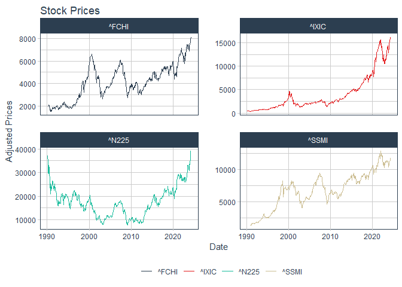
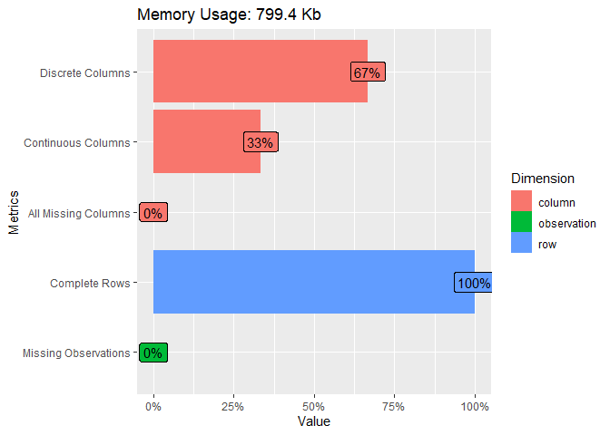

Risques extrêmes et application à la mesure du risque de marché
================
Pierre Clauss
Mars 2024

*Ce document R Markdown a pour objet la résolution des exercices 1.1 et
2.1 du cours.*

## Préambule

Je précise en préambule les 3 étapes nécessaires pour la réussite d’un
projet de data science :

1.  données : (i) importation, (ii) wrangling et (iii) visualisation (ou
    appelée encore *analyse exploratoire des données*)
2.  modélisation
3.  communication des résultats

L’univers du package **tidyverse** est essentiel pour réaliser ces 3
étapes avec R aujourd’hui.

``` r
library(tidyverse)
```

## 1 Données

### 1.1 Importation

Pour les 2 exercices, les données sont les mêmes. J’importe ces données
à l’aide du package
[**tidyquant**](https://business-science.github.io/tidyquant/) qui est
très performant pour importer entre autres des data financières. Je les
importe de [*Yahoo
Finance*](https://fr.finance.yahoo.com/indices-mondiaux) et plus
particulièrement les indices actions CAC 40, NASDAQ Composite, Nikkei
225 et SMI. L’échantillon commence en janvier 1990 et se termine en mars
2023. Je transforme alors ces données en rentabilités.

``` r
library(tidyquant)
symbols <- c("^FCHI", "^IXIC", "^N225", "^SSMI")
stock_prices <- symbols %>%
  tq_get(get  = "stock.prices",
         from = "1990-01-03",
         to   = "2024-04-01") %>%
  group_by(symbol)

(stock_prices %>% slice(1, n()))
```

    ## # A tibble: 8 × 8
    ## # Groups:   symbol [4]
    ##   symbol date         open   high    low  close    volume adjusted
    ##   <chr>  <date>      <dbl>  <dbl>  <dbl>  <dbl>     <dbl>    <dbl>
    ## 1 ^FCHI  1990-03-01  1836   1838   1827   1832          0    1832 
    ## 2 ^FCHI  2024-03-13  8104.  8142.  8090.  8142.         0    8142.
    ## 3 ^IXIC  1990-01-03   461.   462.   460    461. 152660000     461.
    ## 4 ^IXIC  2024-03-13 16220. 16232. 16168. 16185. 587210131   16185.
    ## 5 ^N225  1990-01-04 38922. 38951. 38705. 38713.         0   38713.
    ## 6 ^N225  2024-03-13 39060. 39148. 38453. 38696.         0   38696.
    ## 7 ^SSMI  1990-11-09  1379.  1389   1375.  1387.         0    1387.
    ## 8 ^SSMI  2024-03-13 11757. 11792. 11736. 11791.         0   11791.

``` r
# plot sur données mensuelles
monthly_prices <- stock_prices %>%
  group_by(symbol) %>%
  tq_transmute(select = adjusted,
               mutate_fun = to.monthly,
               indexAt = "lastof")

monthly_prices %>%
  ggplot(aes(x = date, y = adjusted, color = symbol)) +
  geom_line(size = 0.25) +
  labs(
    title = "Stock Prices",
    x = "Date",
    y = "Adjusted Prices",
    color = ""
  ) +
  facet_wrap(~ symbol, ncol = 2, scales = "free_y") +
  theme_tq() +
  scale_color_tq()
```

<!-- -->

``` r
daily_returns <- stock_prices %>%
  group_by(symbol) %>%
  tq_transmute(
    select     = adjusted,
    mutate_fun = periodReturn,
    period     = "daily",
    type       = "arithmetic",
    col_rename = "dreturns"
  )
```

### 1.2 Démêlage (wrangling en anglais)

“Tidying and transforming are called *wrangling*, because getting your
data in a form that’s natural to work with often feels like a fight”
[**R for Data Science**](https://r4ds.had.co.nz/introduction.html)
(Grolemund G. and Wickham H.).

Je peux à l’aide du package **DataExplorer** obtenir un résumé des
données et évaluer si je peux les considérer comme **tidy**.

``` r
library(DataExplorer)
plot_intro(daily_returns)
```

<!-- -->

### 1.3 Visualisation

Les statistiques de base sont résumées par le tableau et les graphiques
ci-dessous. Nous pouvons observer un fait stylisé très important des
rentabilités d’indices de marché, à savoir la leptokurticité de leur
densité.

``` r
daily_returns %>%
  group_by(symbol) %>%
  summarise(moyenne = mean(dreturns),
            ecartype = sd(dreturns),
            nombre = n(),
            min = min(dreturns),
            max = max(dreturns)
  )
```

    ## # A tibble: 4 × 6
    ##   symbol  moyenne ecartype nombre     min   max
    ##   <chr>     <dbl>    <dbl>  <int>   <dbl> <dbl>
    ## 1 ^FCHI  0.000264   0.0135   8642 -0.123  0.112
    ## 2 ^IXIC  0.000520   0.0146   8614 -0.123  0.142
    ## 3 ^N225  0.000108   0.0147   8394 -0.114  0.142
    ## 4 ^SSMI  0.000317   0.0111   8376 -0.0964 0.114

``` r
daily_returns %>%
  ggplot(aes(x = dreturns, fill = symbol)) +
  geom_density(alpha = 0.5) +
  labs(title = "Densités des rentabilités arithmétiques",
       x = "Rentabilités quotidiennes", y = "Densité") +
  theme_tq() +
  scale_fill_tq() +
  facet_wrap(~ symbol, ncol = 2)
```

<!-- -->

``` r
daily_returns %>%
  ggplot(aes(sample = dreturns, colour = factor(symbol))) +
  stat_qq() +
  stat_qq_line() +
  theme_tq() +
  scale_fill_tq() +
  facet_wrap(~ symbol, ncol = 2)
```

<!-- -->

## 2 Modélisation

Les VaR sont soit non-paramétriques (historique et bootstrap) soit
paramétriques (Gaussienne, Skew Student, GEV et GPD).

### 2.1 Résolution de *l’exercice 1.1* du cours

Voici ci-dessous les VaR demandées dans *l’exercice 1.1* pour les
différents indices avec alpha = 1%.

| symbol | Historique | Bootstrap | Gaussienne | Skew_Student |
|:------:|:----------:|:---------:|:----------:|:------------:|
| ^FCHI  |   -3.91%   |  -3.88%   |   -3.12%   |    -3.83%    |
| ^IXIC  |   -4.09%   |  -4.09%   |   -3.35%   |    -6.74%    |
| ^N225  |   -3.88%   |  -3.91%   |   -3.41%   |    -5.33%    |
| ^SSMI  |   -3.16%   |  -3.17%   |   -2.55%   |    -3.48%    |

Voici ci-dessous les VaR demandées dans *l’exercice 1.1* pour les
différents indices avec alpha = 0.1%.

| symbol | Historique | Bootstrap | Gaussienne | Skew_Student |
|:------:|:----------:|:---------:|:----------:|:------------:|
| ^FCHI  |   -6.54%   |  -6.53%   |   -4.15%   |    -7.82%    |
| ^IXIC  |   -7.25%   |  -7.54%   |   -4.46%   |   -24.89%    |
| ^N225  |   -6.85%   |  -6.90%   |   -4.53%   |   -14.28%    |
| ^SSMI  |   -5.57%   |  -5.60%   |   -3.40%   |    -7.77%    |

### 2.2 Résolution de *l’exercice 2.1* du cours

Pour définir la VaR GPD, il est nécessaire de déterminer le seuil à
partir duquel il est raisonnable de penser que les extrêmes suivent une
loi GPD. Cela se fait grâce au mean-excess plot : le seuil optimal est
la valeur à partir de laquelle la tendance est croissante.

<!-- -->

Voici ci-dessous les VaR TVE demandées dans *l’exercice 2.1* pour les
différents indices avec alpha = 1%.

| symbol |  GEV   |  GPD   |
|:------:|:------:|:------:|
| ^FCHI  | -3.08% | -3.82% |
| ^IXIC  | -3.17% | -4.10% |
| ^N225  | -3.39% | -3.91% |
| ^SSMI  | -2.47% | -3.18% |

Voici ci-dessous les VaR TVE demandées dans *l’exercice 2.1* pour les
différents indices avec alpha = 0.1%.

| symbol |  GEV   |  GPD   |
|:------:|:------:|:------:|
| ^FCHI  | -6.05% | -6.65% |
| ^IXIC  | -6.93% | -7.31% |
| ^N225  | -6.36% | -7.16% |
| ^SSMI  | -5.42% | -5.94% |
